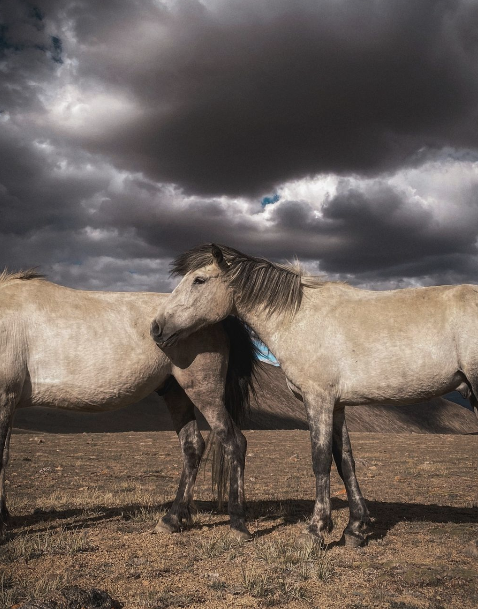
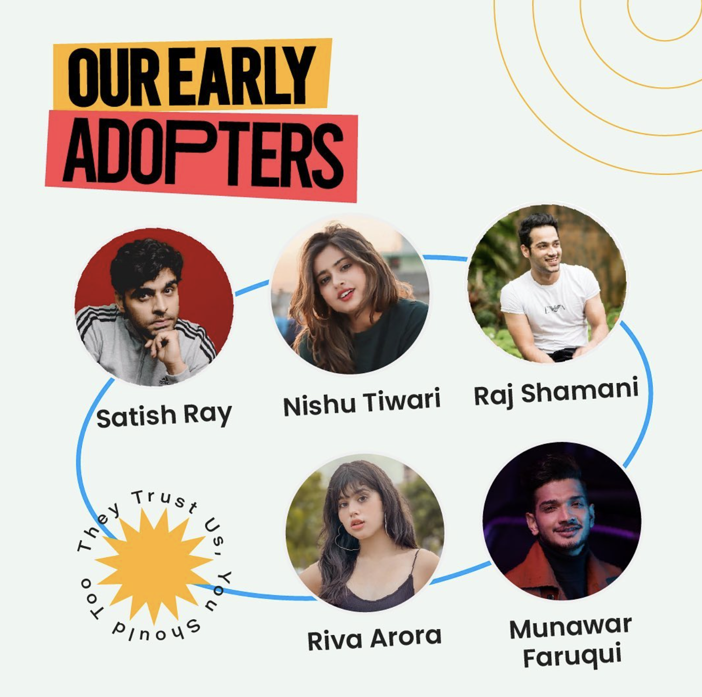

# Image captioner

A simple web app that generates caption for a given image.

Microsoft's GIT (GenerativeImage2Text), base-sized, fine-tuned on COCO is used here. (https://huggingface.co/microsoft/git-base-coco)

During first start the app downloads the model and it is about 800 MiB in size.

Demo Video: [https://drive.google.com/file/d/1BJOvhazDG5ELEV3NCNnPC1LgLePTZHR2/view?usp=sharing](https://drive.google.com/file/d/1BJOvhazDG5ELEV3NCNnPC1LgLePTZHR2/view?usp=sharing)

## Usage
You should have PyTorch setup.  
Note: CPU and CUDA versions of PyTorch are setup differently on different os look more at https://pytorch.org/get-started/locally/

### Local
```bash
pip install torch streamlit transformers

streamlit run app.py

```

Now you can reach the app at http://localhost:8501 or the port streamlit chooses if that one is busy.

## Screenshot


## Samples

| Syntax      | Description |
| ----------- | ----------- |
|  | football player has been a key player for football team        |
|  | a pair of horses stand in a field with a stormy sky behind them. |
|  | we are all about our new logo.                                   |